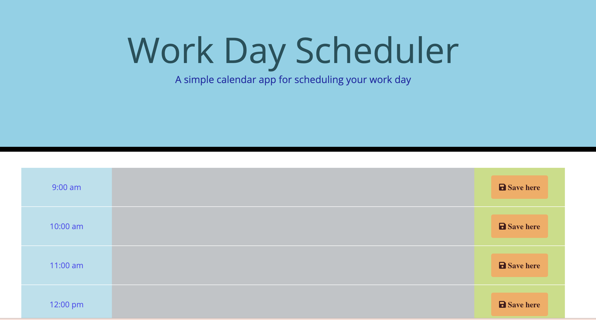

# Daily-Planner-App
A simple calendar application that allows a user to save events for each hour of the day.

## Design
The app:
displays the current day at the top of the calendar when a user opens the planner;
presents timeblocks for standard business hours when the user scrolls down.
color-codes each timeblock based on past, present, and future when the timeblock is viewed;
allows a user to enter an event when they click a timeblock;
saves the event in local storage when the save button is clicked in that timeblock.

## Links

Repo URL: https://github.com/annabessant/Daily-Planner-App 
Website URL: https://annabessant.github.io/Daily-Planner-App/ 

## Screenshot

## Licence

Distributed under the MIT License. See LICENSE.txt for more information.

## Contact

For further details and follow-up: anna@thefutureofinnovation.org 

